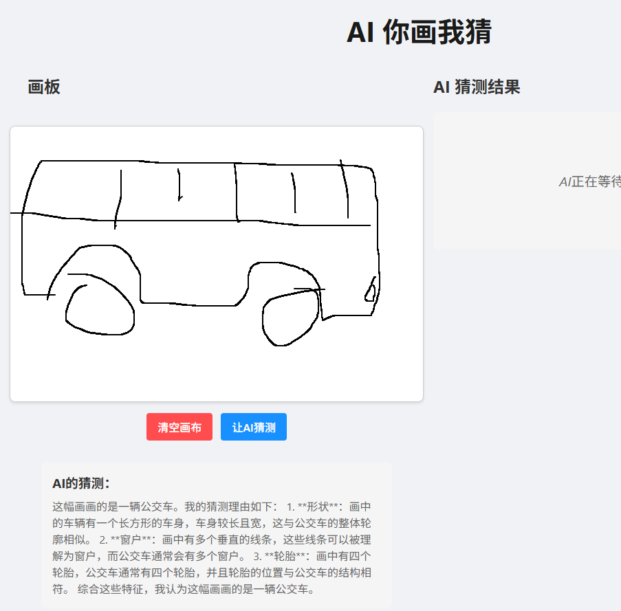
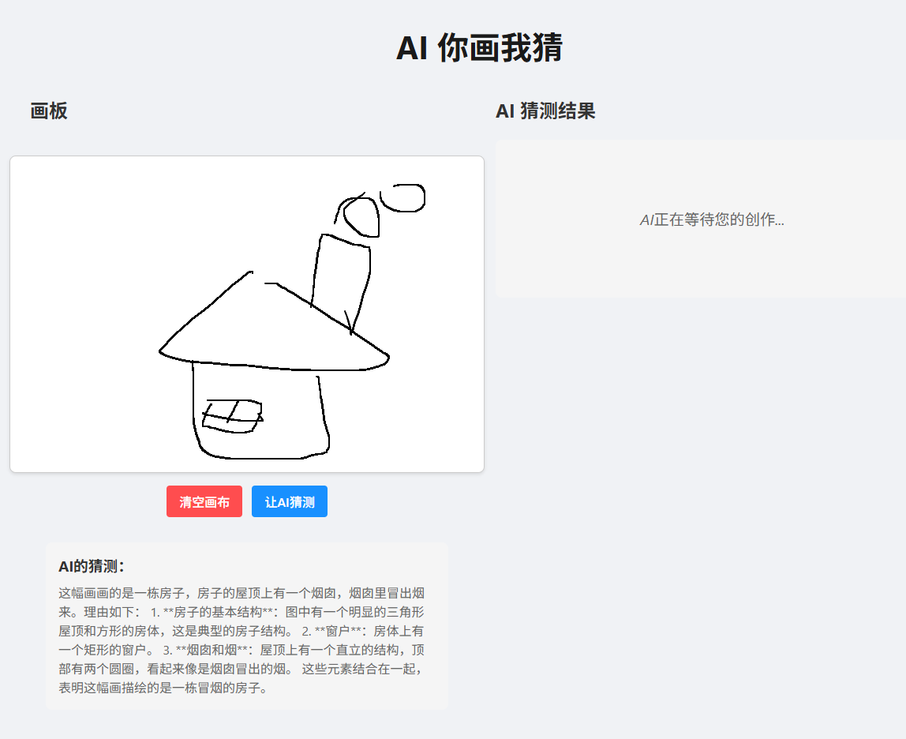

# UDrawIGuess - AI-Powered Drawing Recognition Game

## Introduction
UDrawIGuess is an engaging online drawing game that combines HTML5 Canvas drawing capabilities with OpenAI Vision API's powerful image recognition. Players can freely draw on the canvas, and the AI will recognize and guess the content in real-time, creating a unique gaming experience.

## Tech Stack
- Frontend: React + TypeScript + Vite
- Canvas: HTML5 Canvas
- Backend: Node.js + Express
- AI Integration: OpenAI Vision API

## Features
- Smooth canvas drawing experience
- Real-time AI recognition feedback
- Clean user interface
- Responsive design

## Local Development

### Frontend Setup
```bash
# Navigate to project directory
cd UDrawIGuess

# Install dependencies
npm install

# Start development server
npm run dev
```

### Backend Setup
```bash
# Navigate to server directory
cd server

# Install dependencies
npm install

# Configure environment variables
# Copy .env.example to .env and modify settings
cp .env.example .env

# Start server
npm run dev
```

## Environment Variables
The backend server requires the following environment variables in the `server\src\controllers\canvas.ts` file:

```env
# API Configuration
const openai = new OpenAI({
  apiKey: process.env.OPENAI_API_KEY || "GrokAPIKEY",
  baseURL: process.env.OPENAI_BASE_URL || "https://api.x.ai/v1"
});
```

### 配置Grok API密钥

Sure, here's the translation into English:

---

1. Visit [x.ai](https://x.ai) and sign up for an account.
2. After logging in, go to the API settings page.
3. Create a new API key.
4. Copy the generated API key.
5. In your project’s `\server\src\controllers` file, replace the value of `OPENAI_API_KEY` with your Grok API key.

**Note:**

- Keep your API key secure. Do **not** commit it to your code repository.

## Usage Guide
1. Upon opening the application, you'll see a blank canvas
2. Use your mouse to draw on the canvas
3. Click the "Let AI Guess" button
4. Wait for the AI to analyze and provide its guess
5. To start over, click the "Clear Canvas" button

## Important Notes
- Ensure your drawings are clear and recognizable
- Wait for AI response after each drawing
- Avoid making frequent AI recognition requests in a short time

## Contributing
Issues and Pull Requests are welcome to help improve the project.

## Results

### Bus


### House


## License
MIT License
